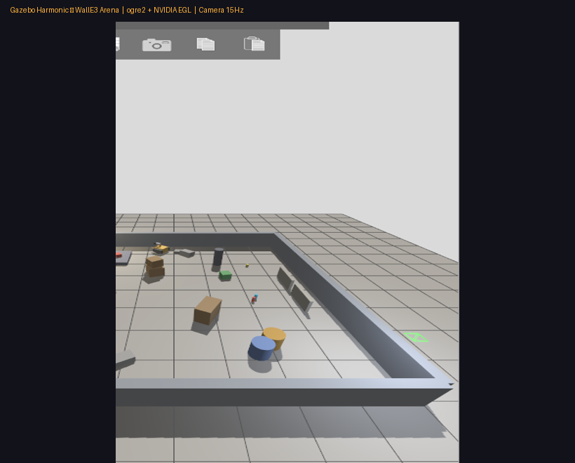
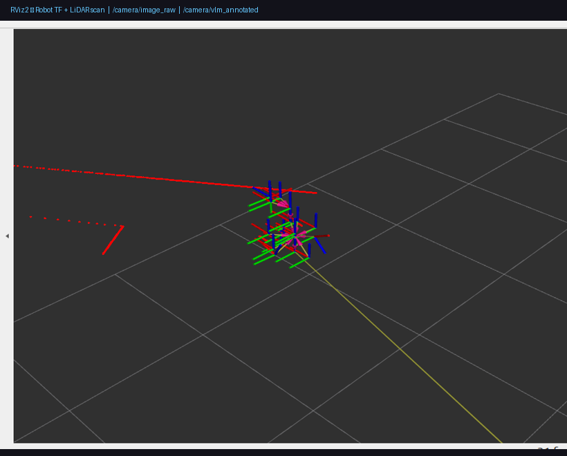
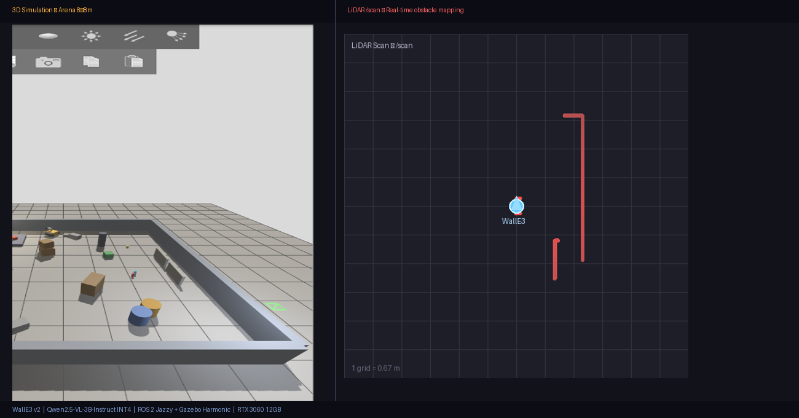

# WallE3 v2 — VLM-Powered Autonomous Robot

[](https://docs.ros.org/en/jazzy/)
[](https://gazebosim.org/)
[](https://huggingface.co/Qwen/Qwen2.5-VL-3B-Instruct)
[](https://python.org/)
[](https://ubuntu.com/)

Robot tự hành điều khiển bằng **ngôn ngữ tự nhiên** (tiếng Việt / English) thông qua Vision-Language Model **Qwen2.5-VL**, kết hợp LiDAR safety và camera obstacle detection — chạy hoàn toàn **local** trên GPU.

---

## Demo

| Gazebo — Arena Simulation | RViz2 — Robot + LiDAR |
|:-------------------------:|:---------------------:|
|  |  |

### AI Pipeline — Simulation + LiDAR Map



---

## Điểm nổi bật

- **Natural Language Control** — gửi lệnh tiếng Việt/English: `"đi tới thùng màu cam"`, `"find the red box"`
- **Vision-Language Model** — Qwen2.5-VL-3B-Instruct (INT4, ~2GB VRAM) chạy local, phân tích camera frame và sinh action plan JSON
- **Dual-loop Architecture** — vòng lặp nhanh 50Hz (LiDAR safety + execution) song song VLM inference (~8s/frame) trên background thread
- **State Machine 6 trạng thái** — IDLE → PLANNING → SEARCHING → APPROACHING → CONFIRMING → COMPLETED
- **Camera Obstacle Detection** — phân tích bottom-frame để phát hiện vật cản thấp hơn tầm quét LIDAR
- **Live Camera Feed** — camera sensor ogre2 + NVIDIA EGL, publish `/camera/image_raw` + `/camera/vlm_annotated` (overlay VLM decision)
- **Expressive Robot** — đầu/tay phản ứng theo trạng thái VLM (vươn tay khi đến đích, nghiêng đầu khi tiếp cận)

---

## Kiến trúc hệ thống

```
────────────────── Gazebo Harmonic (NVIDIA EGL, ogre2) ──────────────────
   Camera 15Hz          LiDAR 10Hz            IMU 100Hz
────────┬───────────────────┬──────────────────────┬──────────────────────
        │    ros_gz_bridge  │                      │
   ─────▼─────         ─────▼─────           ──────▼──────
   /camera/     /scan             /imu
   image_raw
        │
   ─────▼──────────────────────────────────────────────────────
   │              vlm_planner.py  (background thread)          │
   │  Qwen2.5-VL-3B-Instruct INT4 — HuggingFace Transformers  │
   │                                                           │
   │  /user_command ──→ [slow loop ~8s]                        │
   │    camera frame → VLM inference → action_plan JSON        │
   │                                                           │
   │  [fast loop 50Hz]                                         │
   │    LiDAR safety check → execute action → publish cmd_vel  │
   ─────────────┬─────────────────────────────────────────────
                │ /vlm/action_plan   /behavior_state
   ─────────────▼──────────────    ──────────────────────────
   │  wander.py (state machine) │  │  expressive.py           │
   │  Priority 0: VLM_TASK      │  │  head/arm reactions      │
   │  Priority 2: CAM_AVOID     │  │  based on behavior state │
   │  Priority 3: LIDAR AVOID   │  │                          │
   │  Priority 4: WANDER        │  ──────────────────────────
   ─────────────┬───────────────
                │ /diff_drive_base_controller/cmd_vel
   ─────────────▼───────────────────────────────────────────
   │                    ros2_control                         │
   │      diff_drive + head_controller + arm_controller      │
   ──────────────────────────────────────────────────────────
```

### Luồng xử lý VLM

```
User: "đi tới thùng màu cam"
    │
    ▼ /user_command
vlm_planner nhận lệnh → state: PLANNING
    │
    ▼ camera frame (640×480)
Qwen2.5-VL-3B-Instruct inference (~8s)
    │
    ▼ action_plan JSON
{
  "action": "turn_right",
  "target": "thùng màu cam",
  "target_position": "right",
  "linear_speed": 0.2,
  "angular_speed": 0.4,
  "message": "Phát hiện thùng cam bên phải, đang tiếp cận"
}
    │
    ▼ fast loop (50Hz)
Execute action → /cmd_vel → robot di chuyển
    │
    ▼ /camera/vlm_annotated
Frame + state overlay + target indicator → RViz2
```

---

## Cấu trúc project

```
VinUni_proj/
├── run_walle.sh                        # One-command startup
├── walle.rviz                          # RViz2 config (robot + LiDAR + 2 camera feeds)
└── walle_ws/src/
    ├── walle_description/
    │   └── urdf/walle.urdf.xacro       # Robot URDF: camera + LiDAR + IMU + joints
    ├── walle_bringup/
    │   ├── launch/
    │   │   ├── sim.launch.py           # Gazebo + controllers + optional VLM
    │   │   └── vlm.launch.py           # VLM stack only
    │   ├── config/
    │   │   ├── vlm_config.yaml         # VLM model + inference params
    │   │   ├── controllers.yaml        # ros2_control config
    │   │   └── bridge.yaml             # Gazebo ↔ ROS 2 topic bridge
    │   └── worlds/walle_arena.sdf      # Arena 8×8m, ogre2 render engine
    └── walle_demo/walle_demo/
        ├── vlm_planner.py              # VLM planning node (main AI node)
        ├── vlm_perception.py           # Parallel scene understanding
        ├── vlm_utils.py                # VLM backend wrapper (Transformers / Ollama)
        ├── language_interface.py       # Terminal input → /user_command
        ├── wander.py                   # Reactive navigation + camera obstacle detect
        ├── expressive.py               # Head/arm expressive reactions
        └── perception.py               # YOLOv8 fallback (optional)
```

---

## Cài đặt

### Yêu cầu hệ thống

| Thành phần | Yêu cầu |
|-----------|---------|
| OS | Ubuntu 24.04 LTS |
| ROS 2 | Jazzy |
| Gazebo | Harmonic (gz-sim 8) |
| GPU | NVIDIA (≥8GB VRAM khuyến nghị) |
| VRAM | ~2GB cho 3B INT4, ~6GB cho 7B INT4 |
| Python | 3.12+ |
| Display | X11 (DISPLAY:1 với GNOME cho camera rendering) |

### Cài đặt dependencies

```bash
# ROS 2 packages
sudo apt install -y \
  ros-jazzy-ros-gz ros-jazzy-gz-ros2-control \
  ros-jazzy-ros2-control ros-jazzy-ros2-controllers \
  ros-jazzy-cv-bridge ros-jazzy-image-transport \
  ros-jazzy-rviz2

# Python — VLM
pip install \
  transformers accelerate bitsandbytes \
  qwen-vl-utils torch torchvision \
  opencv-python "numpy<2.0" \
  --break-system-packages

# Python — YOLOv8 (optional fallback)
pip install ultralytics --break-system-packages
```

### Build

```bash
cd ~/VinUni_proj/walle_ws
source /opt/ros/jazzy/setup.bash
colcon build --symlink-install
source install/setup.bash
```

---

## Chạy

### One-command startup

```bash
bash ~/VinUni_proj/run_walle.sh
```

Script tự động:
1. Kill processes cũ
2. Khởi động Gazebo (NVIDIA GPU, ogre2, camera enabled)
3. Mở RViz2 (robot model + LiDAR + camera feeds)
4. Load VLM stack — Qwen2.5-VL (~20s từ cache)

### Gửi lệnh cho robot

```bash
# Qua terminal language_interface (tự động mở khi VLM stack chạy)
[WallE] > đi tới thùng màu cam
[WallE] > find the red box
[WallE] > go to the orange barrel

# Hoặc publish trực tiếp
ros2 topic pub --once /user_command std_msgs/msg/String \
  "{data: 'đi tới thùng màu cam'}"
```

### Monitor

```bash
ros2 topic echo /behavior_state        # trạng thái robot: IDLE/PLANNING/APPROACHING/...
ros2 topic echo /vlm/scene_description # VLM mô tả scene hiện tại
ros2 topic echo /vlm/action_plan       # action plan JSON từ VLM
ros2 topic hz /camera/image_raw        # camera rate (~13Hz)
```

---

## Cấu hình VLM

File: `walle_ws/src/walle_bringup/config/vlm_config.yaml`

```yaml
walle_vlm_planner:
  ros__parameters:
    model_name: "Qwen/Qwen2.5-VL-3B-Instruct"  # hoặc 7B nếu đủ VRAM
    quantize_4bit: true                           # INT4 tiết kiệm VRAM
    inference_interval_sec: 8.0
    max_speed: 0.25
    language: "vi"                                # vi hoặc en
```

---

## State Machine

```
IDLE ──(nhận /user_command)──→ PLANNING
PLANNING ──(VLM inference xong)──→ SEARCHING
SEARCHING ──(phát hiện target)──→ APPROACHING
APPROACHING ──(gần target < 0.8m)──→ CONFIRMING
CONFIRMING ──(VLM xác nhận đến nơi)──→ COMPLETED
COMPLETED / timeout ──→ IDLE

CAM_AVOID: camera phát hiện vật cản thấp hơn LiDAR → quay tránh
AVOID: LiDAR phát hiện vật cản → quay tránh
```

---

## Xử lý vật cản thấp (dưới tầm quét LiDAR)

WallE3 v2 kết hợp 2 lớp bảo vệ:

1. **LIDAR mount thấp** — `z = -0.05` so với base_link (~0.18m từ mặt đất), phát hiện vật từ 0.18m trở lên
2. **Camera obstacle detection** — phân tích vùng dưới của frame (60–85% từ trên) so sánh màu sắc với floor sample và mật độ cạnh (Canny edge density) → nếu phát hiện vật lạ → `CAM_AVOID`

```
Camera frame (640×480)
┌─────────────────────────┐
│  0% — top               │
│                         │
│  60% ───────────────    │  ← bắt đầu ROI phân tích
│       │  center 70% │   │
│  85% ───────────────    │  ← kết thúc ROI
│                         │
│ 100% — bottom (floor)   │  ← sample màu sàn từ góc
└─────────────────────────┘
```

---

## Roadmap

- [x] Robot URDF + Gazebo simulation (camera + LiDAR + IMU)
- [x] ros2_control (diff_drive + head + arm controllers)
- [x] LiDAR obstacle avoidance
- [x] YOLOv8 object detection (optional)
- [x] **Qwen2.5-VL Vision-Language Model integration**
- [x] **Natural language commands (Vietnamese/English)**
- [x] **Dual-loop VLM architecture (50Hz + background inference)**
- [x] **Camera sensor enabled (ogre2 + NVIDIA EGL)**
- [x] **VLM annotated camera feed (/camera/vlm_annotated)**
- [x] **Camera-based low obstacle detection**
- [x] **LIDAR mount optimized (z=-0.05, ~0.18m from ground)**
- [ ] SLAM Toolbox — autonomous mapping
- [ ] Nav2 — goal-based path planning
- [ ] Sim-to-real transfer
- [ ] Multi-object tracking

---

## Công nghệ sử dụng

**Robotics:** ROS 2 Jazzy · Gazebo Harmonic · URDF/Xacro · ros2_control · ros_gz_bridge

**AI/ML:** Qwen2.5-VL-3B-Instruct · HuggingFace Transformers · BitsAndBytes INT4 · OpenCV · YOLOv8

**Languages:** Python 3.12 · XML/SDF · YAML · Bash

**Hardware:** NVIDIA RTX 3060 12GB · GPU EGL rendering (ogre2)

---

## Tác giả

**Cong Thai — Robotics & AI Developer**
VinUniversity
