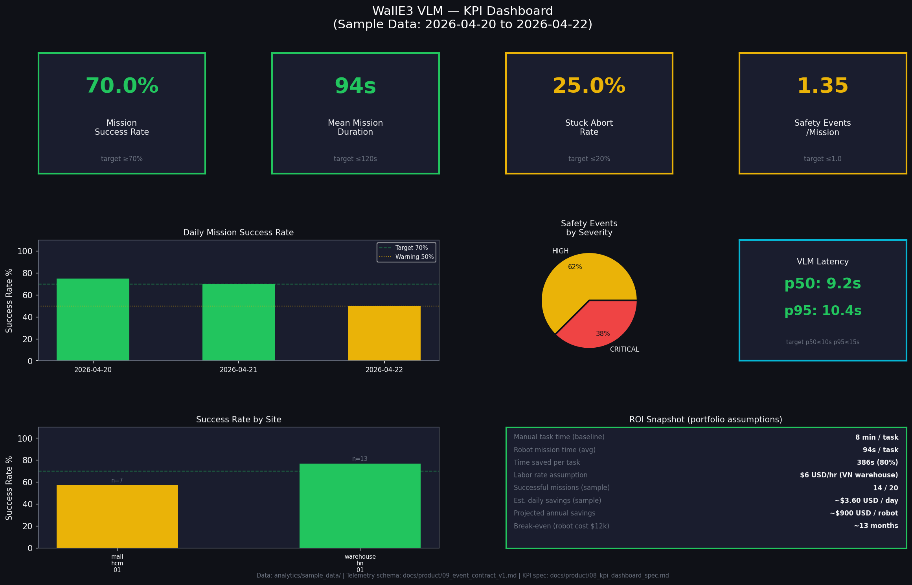

# Analytics — WallE3 VLM

This folder contains data analytics artifacts demonstrating how robot telemetry translates into business KPIs, operational insights, and ROI evidence.

## Structure

```
analytics/
├── sample_data/          CSV fact tables (mission_logger_node.py output schema)
│   ├── fact_missions.csv
│   ├── fact_safety_events.csv
│   └── fact_inference_events.csv
├── sql/                  Business-question-driven SQL queries
│   ├── 01_mission_success_rate.sql     KPI-001: success rate by site/day
│   ├── 02_intervention_rate.sql        KPI-003: safety interventions per mission
│   ├── 03_stuck_abort_root_cause.sql   KPI-004: abort pattern analysis
│   ├── 04_vlm_latency_p95.sql          KPI-005: VLM inference latency
│   └── 05_roi_by_site.sql              ROI estimation from telemetry
├── python/
│   └── mission_kpi_analysis.py         Compute all KPIs + generate dashboard PNG
└── dashboard/
    ├── kpi_dashboard.png               Generated dashboard (see below)
    └── dashboard_spec.md               Layout, colors, Power BI migration path
```

## Run the analysis

```bash
python analytics/python/mission_kpi_analysis.py
```

Outputs `analytics/dashboard/kpi_dashboard.png`.

## KPI Dashboard



## KPI results (sample data, 20 missions over 3 days)

| KPI | Measured | Target | Status |
|-----|----------|--------|--------|
| Mission Success Rate | 70.0% | ≥70% (R0) | ✓ At threshold |
| Mean Mission Duration | 94s | ≤120s | ✓ PASS |
| Stuck Abort Rate | 25.0% | ≤20% (R0) | ⚠ Slightly above |
| Interventions/Mission | 1.35 | ≤1.0 (R0) | ⚠ Above target |
| VLM Latency p50 | 9.2s | ≤10s | ✓ PASS |
| VLM Latency p95 | 10.4s | ≤15s | ✓ PASS |

> Note: Sample data is illustrative. Real deployment KPIs would be computed from live telemetry via `mission_logger_node.py`.

## Run SQL queries

The SQL files use standard SQL compatible with SQLite, PostgreSQL, and BigQuery.

```bash
# Load CSV into SQLite and run a query
sqlite3 :memory: \
  ".mode csv" ".import analytics/sample_data/fact_missions.csv fact_missions" \
  ".import analytics/sample_data/fact_safety_events.csv fact_safety_events" \
  ".import analytics/sample_data/fact_inference_events.csv fact_inference_events" \
  ".read analytics/sql/01_mission_success_rate.sql"
```

## Telemetry → analytics pipeline

The `mission_logger_node.py` subscribes to all 7 event contract topics and writes rows to these fact tables in real-time:

| Topic | → Table | Key field |
|-------|---------|-----------|
| `/mission/completed` | `fact_missions` | `mission_id`, `outcome`, `duration_s` |
| `/safety/event` | `fact_safety_events` | `event_type`, `severity`, `distance_m` |
| `/inference/event` | `fact_inference_events` | `latency_ms`, `confidence`, `target_found` |

See [Event Contract v1.0](../docs/product/09_event_contract_v1.md) for full topic schema.
