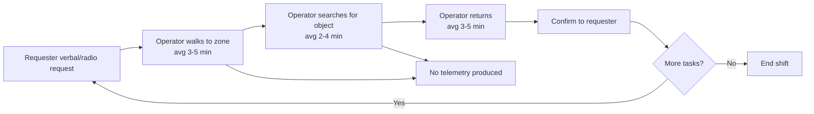
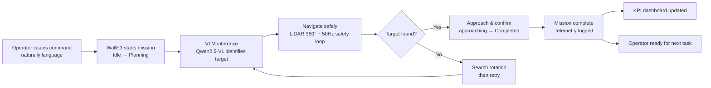

# Workflow Analysis — WallE3 VLM

**Version:** 1.0 | **Date:** April 2026
**Scope:** Locate-and-fetch task in warehouse environment (primary use case)

---

## 1. Current-State Workflow: Manual Locate-and-Fetch

### Process steps

```
Requester                    Operator                      Supervisor
    │                            │                              │
    │ 1. Verbal/radio request     │                              │
    ├────────────────────────────►│                              │
    │                            │ 2. Walk to zone               │
    │                            │    (avg 3–5 min)              │
    │                            │ 3. Search for object          │
    │                            │    (avg 2–4 min)              │
    │                            │ 4. Return with object         │
    │                            │    (avg 3–5 min)              │
    │ 5. Confirmation             │                              │
    │◄────────────────────────────│                              │
    │                            │                              │
    │                            │ (no structured log)          │
    │                            │                              │
    │                            │ 6. Repeat ~40x/day           │
    │                            │                              │
```

### Pain points

| Pain point | Business impact | Measurable? |
|-----------|----------------|-------------|
| High walking time per task | 8–12 min per task × 40 tasks/day = 5–8 hrs/day of walking | Yes — time study |
| No telemetry | Cannot identify which zones take longest; no data for layout optimization | No |
| Layout change → manual re-learning | After each rearrangement, operators must re-memorize zone locations | Partially (supervisor survey) |
| Knowledge dependency | Experienced staff know the layout; new hires are slower | No |
| No audit trail | Cannot investigate when a pick goes wrong | No |

### Baseline metrics (portfolio estimate)

| Metric | Value | Source |
|--------|-------|--------|
| Avg task time (walking + search) | 8 min | Industry estimate; validate via time study |
| Tasks per operator per day | 40 | Operations Manager assumption |
| Operator FTE cost | $6 USD/hr (Vietnam) | Market rate assumption |
| Daily labor on locate-and-fetch | 5.3 hrs × $6 = $31.8 USD/operator | Calculated |
| Annual cost per operator | ~$8,000 USD/yr | Calculated (250 working days) |

---

## 2. Future-State Workflow: WallE3-Assisted Locate-and-Fetch

### Process steps

```
Operator                   WallE3 (Robot)              Mission Logger
    │                           │                           │
    │ 1. Issue command          │                           │
    │   "go to orange box"      │                           │
    ├──────────────────────────►│ /user_command             │
    │                           │                           │
    │                           │ 2. Start mission          │
    │                           │   IDLE → PLANNING         │─────────────────►│
    │                           │   /mission/started        │  {mission_id,     │
    │                           │                           │   timestamp,      │
    │                           │ 3. VLM inference          │   user_command}   │
    │                           │   Qwen2.5-VL analyzes     │                   │
    │                           │   camera frame            │                   │
    │                           │   → action_plan JSON      │                   │
    │                           │                           │                   │
    │                           │ 4. Navigate safely        │                   │
    │                           │   SEARCHING → APPROACHING │                   │
    │                           │   LiDAR: 360° obstacle    │                   │
    │                           │   avoidance at 50Hz       │                   │
    │                           │                           │                   │
    │ 5. Arrival notification   │                           │                   │
    │◄──────────────────────────│ APPROACHING → COMPLETED   │                   │
    │                           │ /mission/completed         │──────────────────►│
    │ (operator can issue        │ {success, duration_s,     │  fact_missions    │
    │  next command)            │  intervention_count}      │  fact_safety_evt  │
    │                           │                           │  fact_inference   │
    │                           │ 6. Telemetry available    │                   │
    │                           │   for KPI dashboard        │──────────────────►│
```

### Improvement analysis

| Dimension | Current state | Future state | Expected improvement |
|-----------|--------------|--------------|----------------------|
| Time per task | 8 min | ~1.5 min (robot mission) + brief operator confirmation | ~80% time reduction on robot-handled tasks |
| Data produced | None | Structured telemetry (mission, safety, inference events) | From 0 to full audit trail |
| Layout adaptability | Operator must re-learn | Natural language — no reprogramming | Eliminates reprogramming cost |
| Scalability | 1 operator = 40 tasks/day | 1 operator monitors 2–3 robots | 2–3× throughput per operator |
| Bottleneck visibility | Not measurable | Visible via KPI dashboard (zone analysis, abort reasons) | Data-driven layout optimization |

### Operator role evolution

The operator role shifts from **physical execution** to **task delegation and exception handling**:

| Activity | Before | After |
|----------|--------|-------|
| Issue task | Receives verbal request, executes physically | Issues natural language command to robot |
| Monitor | Not possible | Watches robot status; intervenes only on exception |
| Handle exception | Handles all tasks | Handles only edge cases (target not found, abort) |
| Report | No data to report | Dashboard available for manager |

---

## 3. Process Flow Diagrams (Mermaid)

### Current state — manual locate-and-fetch



### Future state — WallE3-assisted



---

## 4. Gap Analysis — Current to Future State

| Gap | Barrier | Mitigation |
|-----|---------|-----------|
| Operator training | New interface (voice/text command) | 30-min onboarding (NFR-011); TUI simplifies input |
| Camera coverage | Objects must be in camera FOV | Search rotation behavior covers 360° over time |
| VLM accuracy | Model may misidentify object | Confidence logging; operator confirmation at arrival |
| Safety in human-dense zones | Risk of collision in crowded area | LiDAR 360°, 50Hz safety, 0.35m stop threshold |
| Layout edge cases | Narrow aisles, reflective surfaces | Physical pilot survey required before deployment |

---

## 5. Success Criteria

The future-state workflow is considered successful when:

| Criterion | Metric | Target |
|-----------|--------|--------|
| Mission success rate | % missions reaching COMPLETED | ≥70% R0, ≥85% R2 |
| Task time reduction | Avg robot duration vs manual 8 min | Robot ≤2 min (≥75% faster) |
| Operator acceptance | First successful mission time | ≤30 min from first use |
| Safety | CRITICAL events per day | ≤2 per day per robot (R0) |
| ROI | Payback period | ≤18 months (pilot site) |

See [KPI Dashboard Spec](../product/08_kpi_dashboard_spec.md) for full KPI definitions.
